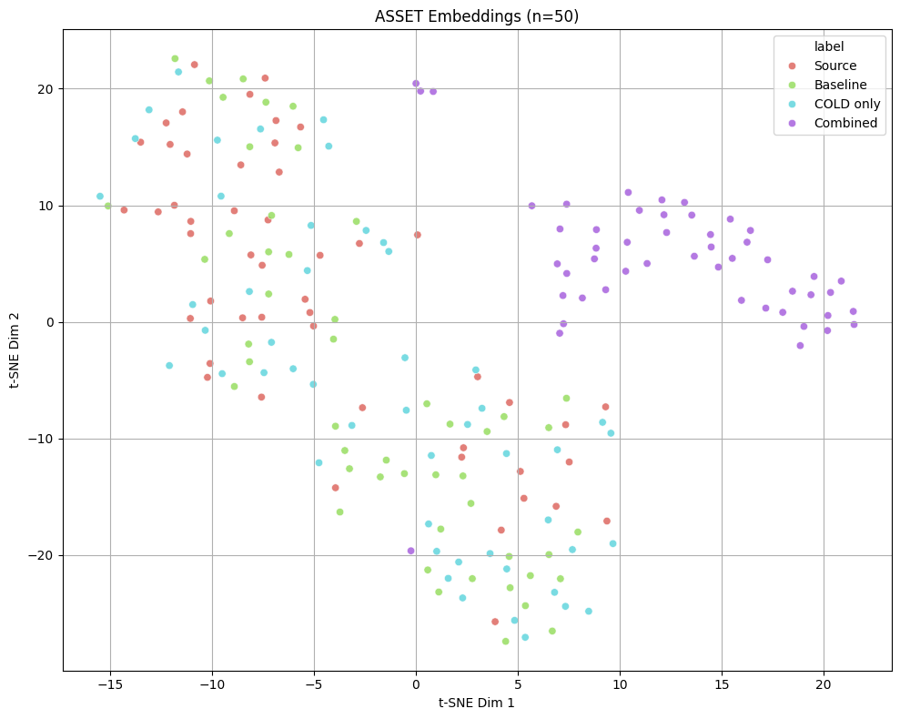

# Energy-Based Text Simplification with Latent Layer Intervention

A Generative AI course project that asks: can we make GPT-2 write simpler sentences without retraining it? Turns out, kind of yes.

The approach: steer decoding with an energy function, then nudge the model's internal representations toward simpler text at layer 4. No full fine-tuning, no paired training data beyond 100 examples, no external models.

## The idea

Complex medical text is hard to read. Fine-tuning a model to fix that requires a lot of paired data and locks you into a specific style. We wanted something more flexible, something you could control at inference time.

So instead of retraining, we wrap the decoding process with two interventions:

1. **Energy-based selection (COLD decoding)** -> generate N candidates, score each one for simplicity, return the winner. The energy function rewards lower perplexity (fluency), shorter sentences, and more common vocabulary.

2. **Latent layer intervention** -> before any of that, fine-tune a single transformer block (layer 4) using forward hooks, pulling the hidden representations of complex sentences toward those of simpler ones. The rest of the model stays untouched.

Three setups are compared end-to-end:

- **Baseline** -> just GPT-2 with a prompt, no tricks
- **COLD only** -> energy-based candidate selection on top of the base model
- **Combined** -> latent-fine-tuned model + COLD decoding

## Method

Energy function for each candidate output `y`:

```
E(y) = w1 * PPL(y) + w2 * len(y) + w3 * (1 - vocab_commonality(y))
```

Lower energy = simpler. Weights are in the `Config` class and easy to tune.

Latent loss for each (complex, simple) training pair:

```
L(e) = ||e - e_p||^2 + lambda * (1 - cos(e, e_p))
```

`e` is the layer 4 embedding of the complex sentence, `e_p` is the target from the simple one. Only that layer's weights get updated, everything else is frozen.

## Dataset

[ASSET](https://huggingface.co/datasets/facebook/asset) -> a text simplification benchmark with 10 human references per sentence. The validation split (2000 examples) is used for latent fine-tuning and the test split for evaluation.

## Results 📊

### Readability (Flesch Reading Ease, higher = simpler)

| Approach | Score | Std | Delta vs Baseline |
|----------|-------|-----|-------------------|
| Reference | 54.0 | 24.9 | - |
| Baseline | 60.8 | 21.2 | - |
| COLD only | 68.2 | 20.9 | +7.4 |
| **Combined** | **83.5** | **14.3** | **+22.7** |

### Semantic Fidelity (BERTScore F1, higher = better)

| Approach | Score | Std | Delta vs Baseline |
|----------|-------|-----|-------------------|
| Baseline | 0.865 | 0.027 | - |
| COLD only | 0.869 | 0.025 | +0.005 |
| **Combined** | 0.818 | 0.016 | -0.046 |

### Contribution breakdown

| Component | Flesch contribution |
|-----------|-------------------|
| COLD decoding alone | +7.4 points |
| Latent fine-tuning (on top of COLD) | +15.2 points |
| **Total gain** | **+22.7 points** |

### What these numbers actually mean

This run tells a cleaner story than before. 🎉

**COLD decoding now pulls real weight.** A +7.4 Flesch gain over baseline means the energy function is doing genuine selection work, not just picking a random sample. The variance held steady (21.2 -> 20.9), so the improvement is consistent, not driven by outliers. BERTScore even ticked up slightly (+0.005), which is a nice sign that lower-energy candidates also tend to be more semantically grounded.

**The latent intervention stacks well on top.** Adding another +15.2 Flesch points brings the combined method to 83.5, which puts it solidly in "easy reading" territory (think clear news writing or conversational English). That's a meaningful jump from baseline's 60.8, which sits closer to dense magazine prose. The gain comes from 100 training pairs and one fine-tuned layer, which is a pretty lightweight intervention for a ~24 point readability shift.

**The BERTScore cost is real but predictable.** Combined drops 0.046 F1 points vs baseline (0.818 vs 0.865). That's the latent intervention doing its job a little too aggressively in some cases, shifting generation enough that outputs drift from the source meaning. It's the classic readability-fidelity tradeoff. For patient-facing summaries or accessibility tools, that trade is probably worth it. For anything requiring precise paraphrase, you'd want to tune lambda down.

**The references themselves score 54.0 Flesch**, which is a useful sanity check. Human simplifications aren't trivially easy either, and our combined method overshoots them at 83.5. That's partly GPT-2 generating short, fragmented sentences when the latent loss pushes hard enough, and partly the energy function penalising length even when some of it is necessary.

One honest note on the training loss: it descended cleanly for the first 4 epochs then diverged upward from epoch 5 onward (ending at 4489 vs starting at 1941). The model was likely overfitting to a small batch of 100 pairs, and the latent loss kept tightening even as generalisation got worse. Capping at 4-5 epochs would probably give a better calibrated model with a slightly lower BERTScore drop.

## Embedding Analysis (t-SNE) 🔍



This plot runs on n=50 examples, which gives a much cleaner picture than the n=20 version from earlier.

The most striking thing here is **how cleanly the combined outputs (purple) separate from everything else.** They form their own dense cluster on the right side of the plot, completely detached from sources, baseline, and COLD outputs. That's the latent intervention working at scale: layer 4 is producing hidden states in a genuinely different region of the representation space, and that shift persists all the way through to the final output.

**Source sentences (red) and baseline outputs (green) are nearly inseparable**, scattered together across the left and center of the plot. This matches the numbers: baseline Flesch is only 60.8 vs source complexity, meaning standard GPT-2 barely moves from the original input distribution even with a simplification prompt. If anything, the baseline is just paraphrasing in the same register.

**COLD-only outputs (cyan) sit between sources/baseline and the combined cluster**, loosely overlapping with both. The energy selection is nudging candidates in the right direction, which explains the +7.4 Flesch improvement, but without the latent shift the model is still sampling from the same underlying distribution. A few cyan points break toward the upper-left, which likely correspond to the cases where COLD happened to select a genuinely shorter, simpler candidate.

**The purple cluster is tight and cohesive**, much more so than the spread of other groups. This is actually slightly surprising: the combined outputs have lower BERTScore variance (0.016 std vs 0.027 for baseline), suggesting the fine-tuned model is generating in a more consistent style even if that style drifts from the references. Whether that's a good thing depends on what you're optimising for.

## What we actually got working ✅

- COLD decoding alone gave a solid +7.4 Flesch improvement with no change to the model at all
- The combined method hits 83.5 Flesch (+22.7 over baseline) from 100 training pairs and one fine-tuned layer
- BERTScore stays reasonable at 0.818, only 0.046 below baseline
- The t-SNE shows clean geometric separation: combined outputs occupy a distinct region in embedding space, confirming the latent intervention does something real
- COLD slightly improved BERTScore too (+0.005), meaning energy-based selection doesn't hurt semantic quality

## What we couldn't quite crack 🚧

- The training loss diverged after epoch 4, going from 1737 at epoch 3 all the way to 4489 by epoch 10. The latent fine-tuning overfit hard on 100 pairs. Stopping early would likely give better results
- GPT-2 is still a small, old model. Outputs are more readable but factually unreliable. The combined method in particular generates fluent-sounding nonsense in several test cases
- The 0.046 BERTScore drop is the readability-fidelity trade-off showing up in practice. Some combined outputs have drifted far enough from the source that they'd be misleading in a real application
- One fine-tuned layer has limited reach across a 12-layer model. The representation shift at layer 4 is real (t-SNE confirms it) but doesn't always survive the remaining 8 layers intact
- We didn't get to the medical domain (MIMIC-III) in the end. The 4-week timeline meant we validated on ASSET and called it 😅

## Getting started

```bash
pip install torch transformers datasets bert_score scikit-learn matplotlib seaborn
```

Run the notebook top to bottom. GPU recommended but not required for small runs. All hyperparameters are in the `Config` class:

- `NUM_CANDIDATES` -> candidates per COLD step (we used 5)
- `TARGET_LAYER` -> which layer to fine-tune (we used 4)
- `LAMBDA` -> cosine similarity weight in the latent loss
- `NUM_EPOCHS` -> we'd suggest stopping at 4-5 based on training loss behaviour
- `W_PPL`, `W_LEN`, `W_VOCAB` -> energy function weights

## Structure

```
energy_text_simplification.ipynb   everything
README.md                          this
tsne_plot.png                      embedding visualization (n=50)
```

## References

- Qin et al. (2023) -> COLD Decoding
- Dathathri et al. (2019) -> Plug-and-Play Language Models
- Jiang et al. (2020) -> WikiAuto
- Tu et al. (2020) -> Energy-based Models for Text Generation
